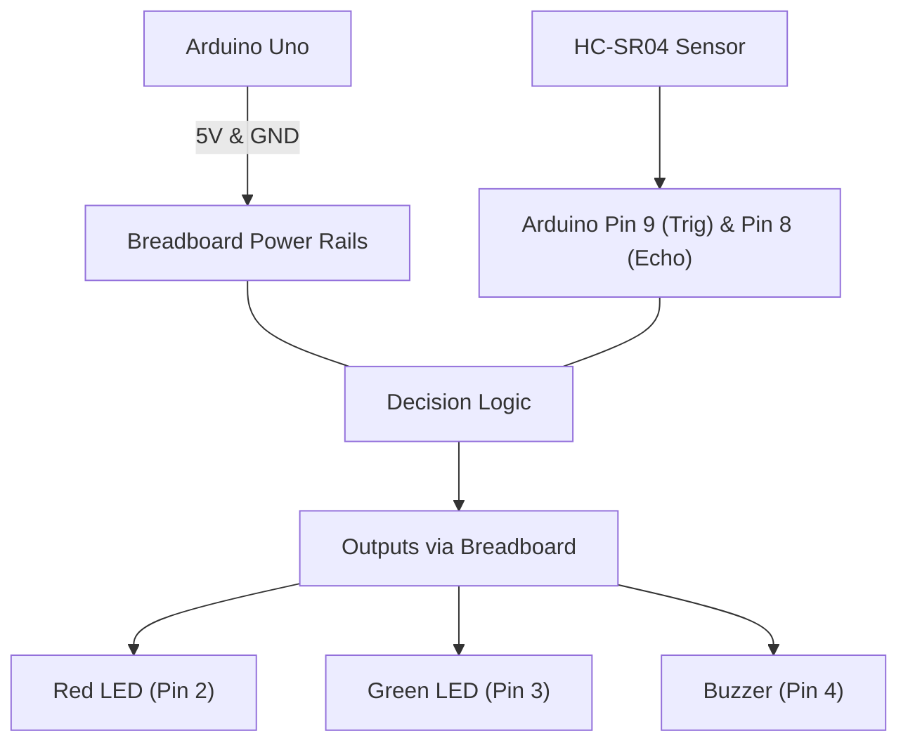

# Project-1_Assignment

**Name:** Ikenna Onugha

**GitHub Repository:** `(https://github.com/Ikennaonugha/Project-1_Assignment/)`

**Date:** Oct 7, 2026

---

## Repository Structure

```text
Project-1_Assignment/
├── README.md
├── question1/
│   └── question1.c
│   └── README.md
├── question2/
│   └── question2.c
│   └── README.md
├── question3/
│   └── question3.c
│   └── README.md
└── question4/
    └── README.md
    ├── parking_system.ino

```

---

## Question 1: Water-Quality Monitoring System

### 1. Source Code (`question1.c`)

```c
/* [INSERT YOUR QUESTION 1 C SOURCE CODE HERE] */

```

### 2. Output & Input Validation

```text
/* [INSERT YOUR SAMPLE PROGRAM RUN OUTPUT / TERMINAL TEST CASES HERE] */

```

### 3. Technical Explanations

* **a. Real-World Application:**
`[INSERT REAL-WORLD APPLICATION EXPLANATION, E.G., ENGINE CONTROL UNITS (ECUs) / SENSOR MONITORING]`
* **b. Error Analysis:**
* **Syntax Error:** `[INSERT SYNTAX ERROR EXAMPLE AND REASONING]`
* **Semantic Error:** `[INSERT SEMANTIC/LOGIC ERROR EXAMPLE AND REASONING]`


* **c. Compilation Lifecycle:**
* **1. Preprocessing (`.c` → `.i`):** Input: Raw source code. Output: Expanded source code with headers resolved.
* **2. Compilation (`.i` → `.s`):** Input: Preprocessed source code (`question1.i`). Output: Assembly code (`question1.s`).
* **3. Assembly (`.s` → `.o` / `.obj`):** Input: Assembly code (`question1.s`). Output: Machine code object file (`question1.o`).
* **4. Linking (`.o` → Executable Binary):** Input: Object file (`question1.o`) and standard C libraries. Output: Executable binary file (`./question1`).


---

## Question 2: Mobile-Money Transaction System

### 1. Source Code (`question2.c`)

```c
/* [INSERT YOUR QUESTION 2 C SOURCE CODE HERE] */

```

### 2. Output & Menu Navigation

```text
/* [INSERT YOUR SAMPLE PROGRAM RUN OUTPUT / TRANSACTION RESULTS HERE] */

```

### 3. Technical Explanations

* **a. Switch-Case vs. If-Else:**
`[INSERT COMPARISON EXPLAINING READABILITY AND JUMP TABLES/BRANCHING]`
* **b. Control Flow & Buffer Management:**
`[INSERT EXPLANATION OF HOW THE MENU LOOP HANDLES INVALID INPUT AND INPUT BUFFER CLEARING]`

---

## Question 3: Delivery Distance & Priority Analysis

### 1. Source Code (`question3.c`)

```c
/* [INSERT YOUR QUESTION 3 C SOURCE CODE HERE] */

```

### 2. Output & Array Operations

```text
/* [INSERT YOUR SAMPLE PROGRAM RUN OUTPUT / DISTANCE COMPUTATION RESULTS HERE] */

```

### 3. Technical Explanations

* **a. Arrays vs. Pointers in Memory:**
`[INSERT EXPLANATION OF ARRAY CONTIGUOUS MEMORY STORAGE AND POINTER ARITHMETIC]`
* **b. Recursive vs. Iterative Analysis:**
`[INSERT COMPARISON OF STACK OVERHEAD/MEM MEMORY FOR RECURSION VS ITERATION]`

---

## Question 4: Smart Parking System Simulation (Tinkercad)

### 1. Circuit & Tinkercad Information

* **Tinkercad Public Link:** `[INSERT YOUR PUBLIC TINKERCAD SIMULATION LINK HERE]`
* **Arduino C Code (`parking_system.ino`):**

```cpp
/* [INSERT YOUR ARDUINO INO CODE HERE] */

```

### 2. Circuit Wiring & Component Roles

| Component | Arduino Pin | Description / Purpose |
| --- | --- | --- |
| **HC-SR04 Ultrasonic Sensor** | Trig: Pin 9, Echo: Pin 8 | Measures distance to parked vehicle |
| **Red LED** | Pin 2 | Indicates spot is OCCUPIED |
| **Green LED** | Pin 3 | Indicates spot is AVAILABLE |
| **Piezo Buzzer** | Pin 4 | Emits alert when distance threshold is breached |
| **Breadboard & 220$\Omega$ Resistors** | 5V / GND Rails | Power distribution and current limiting for LEDs |

### 3. System Data Flow Diagram



### 4. Simulation Test Cases & Results

```text
/* [INSERT YOUR TEST CASES RESULTS (E.G., Distance < 10cm -> Red LED ON, Buzzer Active; Distance >= 10cm -> Green LED ON)] */

```
