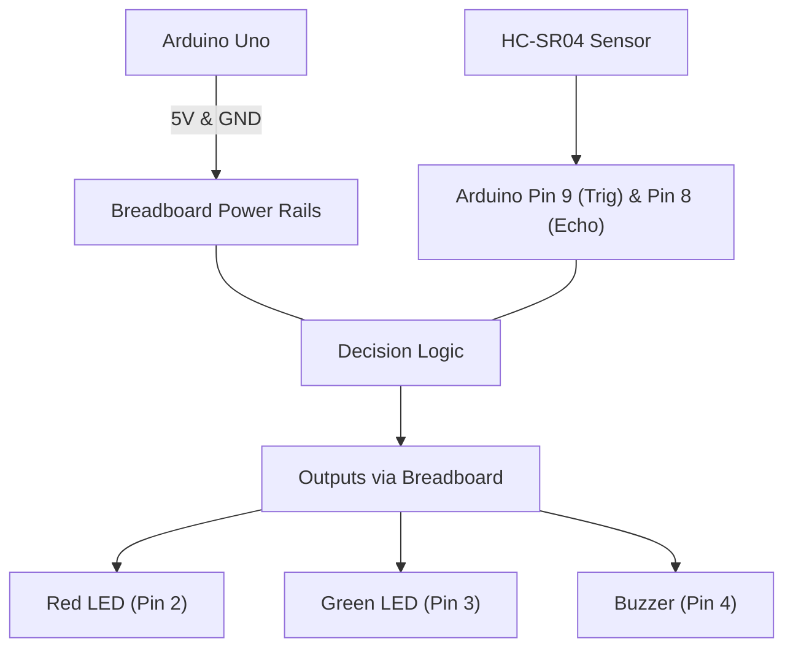

```mermaid
graph TD
    Arduino["Arduino Uno"] -- "5V & GND" --> Rails["Breadboard Power Rails"]
    Sensor["HC-SR04 Sensor"] --> Pins["Arduino Pin 9 (Trig) & Pin 8 (Echo)"]
    
    Rails --- Logic
    Pins --- Logic["Decision Logic"]
    
    Logic --> Outputs["Outputs via Breadboard"]
    
    Outputs --> LED_Red["Red LED (Pin 2)"]
    Outputs --> LED_Green["Green LED (Pin 3)"]
    Outputs --> Buzzer["Buzzer (Pin 4)"]
```
